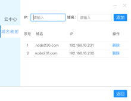
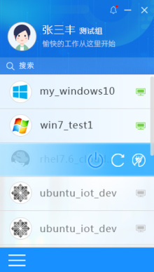
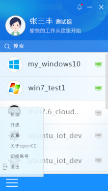

# opencc-ovirt-win oVirt开源桌面客户端windows版

## 描述

opencc-ovirt-win是一款能够直接连接oVirt虚拟化平台使用的桌面客户端软件，安装和运行在windows系统上，连接oVirt中的虚拟机。opencc-ovirt-win采用js开发，使用了流行的vue框架，集成了remote-viewer（一款开源的spice协议客户端）。

## 截图








## 安装运行

```bash
# 1. 安装 nodejs
# 搜索官网 nodejs 安装包, 下载安装
http://nodejs.cn/download/

# 2. 克隆代码
git clone git@gitee.com:cnovirt/opencc-ovirt-win.git
cd opencc-ovirt-win

# 3. 安装依赖
# 如果下载不成功, 可以配置国内阿里源
npm install

# 4. 运行
npm run dev
```

## 打包

```bash
# 1. 使用管理员运行 cmd

# 2. 克隆代码
git clone git@gitee.com:cnovirt/opencc-ovirt-win.git
cd opencc-ovirt-win

# 3. 安装依赖
# 要使用 npm 或 yarn 安装程序依赖包
# 使用 cnpm 安装依赖有些包有些不同, 导致打包失败
npm install 或 npm i
cnpm install

# 4. 测试运行
npm run dev

# 5. 打包
npm run build

# 根据不同操作系统打包
npm run build:win32
npm run build:linux

# 清空打包内容
npm run build:clean
```

---

## 打包问题

### 在 build 过程中, 下载 github 网站的依赖包超时问题

```bash
# 解决在windows下的问题

在项目中有 `packagelib/electron-v2.0.18-win32-x64.zip` 文件
将此文件放入 `C:\Users\用户名称\AppData\Local\electron\Cache`
electron 缓存目录,解决下载慢问题

如果是其它文件, 同上.
将下载的文件 url 拷贝出来, 在浏览器或迅雷下载器中下载下来, 放入缓存目录
```

```bash
# 解决在Ubuntu下的问题
Ubuntu 下载缓存 electron 依赖包缓存地址
`/home/用户名/.cache/electron/`
```

### 运行问题

**Webpack ReferenceError: process is not defined**

高版本的 node，大于 12 的版本时候。使用 electron-vue 项目时候会报错！

修改 .electron-vue/webpack.renderer.config.js 和 webpack.web.config.js 如下：

- webpack.web.config.js

```bash
    new HtmlWebpackPlugin({
      filename: 'index.html',
      template: path.resolve(__dirname, '../src/index.ejs'),
      # 只要粘贴这个函数就行
      templateParameters(compilation, assets, options) {
        return {
          compilation: compilation,
          webpack: compilation.getStats().toJson(),
          webpackConfig: compilation.options,
          htmlWebpackPlugin: {
            files: assets,
            options: options
          },
          process,
        };
      },
      minify: {
        collapseWhitespace: true,
        removeAttributeQuotes: true,
        removeComments: true
      },
      nodeModules: false
    }),
```

- webpack.render.config.js

```bash
    new HtmlWebpackPlugin({
      filename: 'index.html',
      template: path.resolve(__dirname, '../src/index.ejs'),
      minify: {
        collapseWhitespace: true,
        removeAttributeQuotes: true,
        removeComments: true
      },
      # 只要粘贴这个函数就行
      templateParameters(compilation, assets, options) {
        return {
          compilation: compilation,
          webpack: compilation.getStats().toJson(),
          webpackConfig: compilation.options,
          htmlWebpackPlugin: {
            files: assets,
            options: options
          },
          process,
        };
      },
      nodeModules: process.env.NODE_ENV !== 'production'
        ? path.resolve(__dirname, '../node_modules')
        : false
    }),
```
